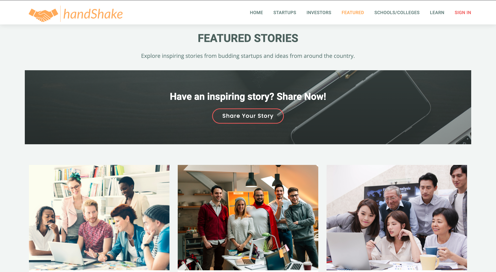

# handShake - Innovathon Project (Team RgR)

### ..where ideas meet investments..

handShake for Startups is a platform to support thriving, diverse, and inclusive startup communities around the world. We connect startups with the right people, products, and best practices to help your startup grow.

## Table of Contents
1. [Live Demo](#live-demo)
2. [Features](#features)
3. [Technologies](#technologies)
4. [Installation](#installation)


## Live Demo 
***
Project Link: https://young-falls-93265.herokuapp.com/

## Features
***

* A platform where startups, small or large, can list themselves and showcase their products.
* A marketplace where investors can find new and upcoming startups to invest in and follow their progress.
* A connecting medium between ideas and investments.
* A unique concept to list budding startups from schools and colleges.
* A special section for inspiring stories of startups growing from scratch.
* A learn section for amateurs as well as experts to learn and share knowledge.
## StartUps

 
 
## Investors

 
## Screenshots



## 


## Technologies
***
A list of technologies used within the project:
* HTML5
* CCS3
* JavaScript
* Express
* MongoDB
* NodeJs
* Mongoose
* PassportJS
* RazorPay API 
* Heroku

## Installation
***
A little intro about the installation. 
```
$ git clone https://github.com/garvit170/RgR_Innovathon.git

```
```
$ npm install

```
```
$ node index.js 
or
$ npm start
```
